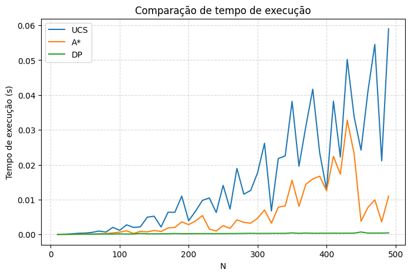

# Search Algorithms Benchmark in Implicit Graphs

[](https://www.python.org/)

[](https://opensource.org/licenses/MIT)

This project explores different algorithmic approaches to solve a one-dimensional transportation problem modeled as an implicit graph. The main goal is to find the minimum cost path to reach state *N* from an initial state *1*, comparing the efficiency of classic search algorithms and dynamic programming.


## 📌 The Problem

The environment is defined by two possible actions in each state :

1. **Walk:** Move from *i* to *i+1* with a cost of 1.
2. **Magic:** Move from *i* to *2i* with a cost of 2.

In addition to the base problem, the project explores a **restricted variant** where the agent is required to pass through at least 3 odd numbers before reaching the goal, which increases the complexity of the state space.


## 🚀 Implemented Algorithms

The project demonstrates the use of three main strategies, applied agnostically to the problem modeling:

* **Uniform Cost Search (UCS):** A blind search that guarantees optimality by exploring nodes in increasing order of accumulated cost.
* **A\* (A-Star):** An informed search that uses a **Heuristic** (future cost estimation) to guide the algorithm, significantly reducing the number of expanded nodes compared to UCS.
* **Dynamic Programming (DP):** A *bottom-up* approach that solves the problem linearly by taking advantage of the overlapping subproblems structure.


## 📊 Performance Analysis

One of the central points of this repository is the performance comparison between the different approaches.

* **Dynamic Programming (DP):** Proved to be the fastest approach. By processing each state exactly once and having constant cost transitions, its complexity is linear , making it ideal for high values of N.
* **A\* vs UCS:** The A* algorithm showed superiority over UCS, proving that a well-defined heuristic allows "pruning" the search space and finding the solution in less time.


### Performance Visualization

Below is the benchmark graph comparing the execution time (in seconds) of each algorithm as the value of *N* increases:

<p align="center">

</p>


## 🛠️ Technologies Used

* **Python 3**
* **Matplotlib** (Data visualization and benchmarks)
* **Jupyter Notebook / Google Colab**

## 🏁 How to Run

1. Clone the repository:
    ```bash
    git clone https://github.com/vitor-rodovalho/search-algorithms-benchmark.git
    ```

2. Open the `.ipynb` file in Jupyter Notebook or upload it to [Google Colab](https://colab.research.google.com/).

3. Execute the cells to view the implementations and performance graphs.


---

## ⚠️ Language Note

Please note that the code comments are currently in **Portuguese**, as this project was originally developed for a university assignment.

## 📄 Author

Developed by **Vitor Hugo Rodovalho**.


---

**License**: MIT License
